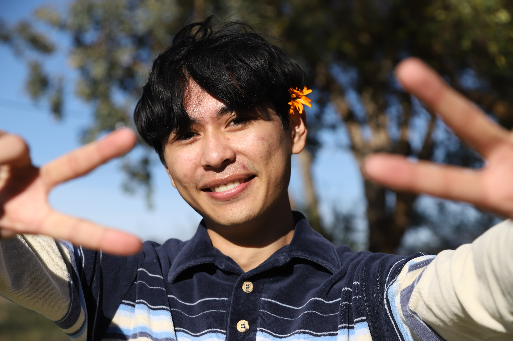

# Anthony Gonzalez
[A little bit about ME](#a-little-bit-about-me)

[Hobbies](#Hobbies)

---

## A little bit about ***ME***
Currently I am involved with hosting various programming workshops for different age ranges and programming languages! Below are the workshops I've done and upcoming workshops! *(to see the presentations click on the workshop!)*

- [x] [Scratch Workshop](https://docs.google.com/presentation/d/1reY6ycHb6DzZ9MBXzKFyPfGAW2KCfdl2lH7D9Cpz-Sw/edit?usp=sharing)
- [x] [Boy Scouts Programming Merit Badge](https://docs.google.com/presentation/d/1Nrjzg8ITwJIChqWBTUHun3WV65C2Zvo8/edit?usp=sharing&ouid=109200728709892459332&rtpof=true&sd=true)
- [ ] Girl Scouts Programming for Good Badge
- [ ] HTML and CSS workshop
---

> *I didn't choose this life, this life chose me.*

I was previously apart of **TWO** eSport teams at UCSD
- Rocket League
- Valorant

However these hobbies were too time consuming so I chose to move onto different activities (such as the previously mentioned workshop hosting) as well as having a good social life while at college.

## Hobbies
Some  other little things I enjoy include

1. [Music](https://open.spotify.com/user/gonzalezanthony042?si=f1335bcc727d4318)
2. [Photography](photographyStuff/IMG_7431.JPG)
3. Reading
4. Adventuring

`System.out.println("Thank You For Reading!")`